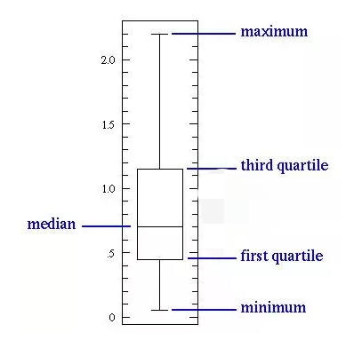
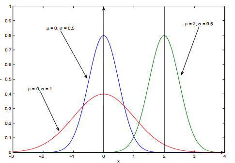

### 描述性统计

#### 1.数据集中趋势的度量

- **平均数：**

  是表示一组数据集中趋势的量数，是指在一组数据中所有数据之和再除以这组数据的个数。

```math
\overline x = \frac{1}{n} {\sum_1^n x_i}
```

- **中位数：**

  是指在一组数据，按顺序排列后，居于中间位置的数。中位数描述数据中心位置的数字特征，对于对称分布的数据，均值与中位数比较接近；对于偏态分布的数据，均值与中位数不同。中位数不受异常值的影响，具有稳健性。

```math
m_e = x_{(\frac{n+1}{2})} \ \ \  当n为奇数时

m_e = \frac{1}{2} (x_{(\frac{n}{2})} + x_{(\frac{n+1}{2})}) \ \ \  当n为偶数时
```

|             图片              | 举个栗子                                                     |
| :---------------------------: | :----------------------------------------------------------- |
| 举个栗子| 如果数字个数为奇数，则为中间那个数字，如果中间位置上有两个数（数字为偶数个），则取两个数的平均数。比如3，7，4，9，2，5，8这组数据的中数为5；而3，7，4，9，2，5这组数据的中数则是（4+5）/2＝4.5。中位数说明的是生活中的中等水平。如“成绩班级中等” |

- **频数**：指同一观测值在一组数据中出现的次数（掷骰子中，一共掷了20次，出现数字5的次数）。
- **众数：**就是一组数据中，出现次数最多的那个数（几个数）。

| 图片              | 举个栗子                                                     |
| ----------------- | :----------------------------------------------------------- |
| 例子 | 在1，2，3，3，4，5这组数据的众数就是3，因为它出现了两次。众数说明的是生活中的多数情况。诸如“最佳”、“最受欢迎”、“最满意”、“举手表决”等，都与众数有关系，它反映了一种最普遍的倾向。 |

------

- **均值 vs 中位数 vs 众数**

|        |                         优点                         |       缺点       |
| :----: | :--------------------------------------------------: | :--------------: |
|  均值  |              充分利用所有数据，适用性强              | 容易受极端值影响 |
| 中位数 |                    不受极端值影响                    |    缺乏敏感性    |
|  众数  | 不受极端值影响；当数据具有明显的集中趋势时，代表性好 |    缺乏唯一性    |


- **百分位数：**

百分位数是中位数的推广，将数据按从小到大排列后，对于
$$ 0 \leq p < 1 $$
它的p分位点定义为
```math
mp = x_{([np] + 1)}, \ \ \ 当np不是整数时

mp = \frac{1}{2}(x_{([np])} + x_{([np] + 1)}), \ \ \ 当np是整数时
```
其中，**[np]**表示**np**的整数部分。所以，0.5分位数（第50百分位数）就是中位数。

百分位数最常见的就是箱型图，四等分位


| 图片              | 举个栗子                                                     |
| :---------------- | :----------------------------------------------------------- |
| 例子| 假如100个学生，将成绩**从低到高**排列，假设成绩从最低的1分到最高的100分，那么成绩排在第3的数值（即3分，倒数第三名）就是第3百分位数（P3），而排在第95的数值（即95分，第六名）的就是第95百分位数。 

**python实现**
``` Python
#NumPy系统是Python的一种开源的数值计算扩展。用来存储和处理大型矩阵。
import numpy as np 
a = [1,2,4,5,3,12,12,23,43,52,11,22,22,22]
a_mean = np.mean(a)  #均值
a_med = np.median(a)  #中位数
print("a的平均数:",a_mean)
print("a的中位数:",a_med)
#------------------------------------------------------------
from scipy import stats   
'''
Scipy是一个高级的科学计算库，Scipy一般都是操控Numpy数组来进行科学计算，
Scipy包含的功能有最优化、线性代数、积分、插值、拟合、特殊函数、快速傅里叶变换、
信号处理和图像处理、常微分方程求解和其他科学与工程中常用的计算。
'''
a_m1 =stats.mode(a)[0][0]
print("a的众数:",a_m)
#-------------------------------------------------------------
import pandas as pd
#将一维数组转成Pandas的Series，然后调用Pandas的mode()方法
ser = pd.Series(a)
a_m2 = ser.mode()
print("a的众数:",a_m)
```

---

#### 2.数据离散趋势的度量
表示数据分散（离散，差异）程度的特征量有方差，标准差，极差以及变异系数等。

- **方差：**

  用来计算每一个变量（观察值）与总体均数之间的差异。实际工作中，总体均数难以得到时，应用样本统计量代替总体参数，经校正后，样本方差计算公式：

```math
S^2 = \frac{1}{n-1} \sum_1^n(x_i - \overline x)^2
```

甲、乙两人同时向目标靶射击10发子弹，甲射击的环数分别是：

| 甲   | 4    | 4    | 4    | 5    | 6    | 8    | 9    | 10   | 10   | 10   |
| ---- | ---- | ---- | ---- | ---- | ---- | ---- | ---- | ---- | ---- | ---- |
| 乙   | 6    | 6    | 6    | 7    | 7    | 7    | 7    | 8    | 8    | 8    |

射击结果都为平均**7**环。因为乙的射击点较集中，射击的稳定性较好，所以乙的射击效果较好。这里的方差的作用就体现了。甲的方差为2.66，乙的方差为0.82。


- **标准差：**

 样本方差的开平方成为样本标准差。样本标准差的计算公式为：
 
```math
s = \sqrt{S^2} = \sqrt{ \frac{1}{n-1} \sum_1^n(x_i - \overline x)^2 }
```

- **极差：**

  数据越分散，极差越大。

```math
R = x_{(n)} - x_{(1)} = max(x) - min(x)
```

- **变异系数：**
  - 是刻画数据相对分散性的一种度量。变异系数只在平均值不为零时有定义，而且一般适用于平均值大于零的情况。变异系数也被称为**标准离差率**或**单位风险**。
  - 当需要比较两组数据离散程度大小的时候，如果两组数据的测量尺度相差太大，或者数据量纲的不同，变异系数可以消除测量尺度和量纲的影响。

  变异系数的计算公式为：
```math
CV = 100 * \frac{s}{\overline x}(\%)
```

- **四分位差**：

  样本上、下四分位数之差称为四分位差(或半极差)。
  $$ R_1 = Q_3 - Q_1 $$
  它也是度量样本分散性的重要数字特征，特别对于具有异常值的数据，它作为分散性具有稳健性<font color=red>  **（见百分位数示意图）**</font>。
  
  
  

**Python实现**
```python
import numpy as np 
a = [1,2,4,5,3,12,12,23,43,52,11,22,22,22]
a_var = np.var(a)  #方差
a_std1 = np.sqrt(a_var) #标准差
a_std2 = np.std(a) #标准差
a_mean = np.mean(a)  #均值
a_cv =  a_std2 /a_mean #变异系数
print("a的方差:",a_var)
print("a的方差:",a_std1)
print("a的方差:",a_std2)
print("a的变异系数:",a_cv)
```

 
#### 3. 分布特征
**引言：** 描述一个随机变量，不仅要说明它能够取那些值，而且还要关心它取这些值的概率（可能性）。

- **离散变量与连续变量：**

  离散型随机变量是指其数值只能用**自然数或整数**单位计算的则为离散变量。例如，<font color=red>  班级人数，电脑台数等，</font>只能按计量单位数计数，这种变量的数值一般用计数方法取得。

  反之，在一定区间内可以任意取值的变量叫连续变量，其数值是连续不断的，即可取无限个数值。例如，<font color=red>人体测量的身高，体重等。</font>
  
 - **概率函数：** 就是用函数的形式来表达概率。
 
<font color=red>  （大量重复试验中出现的频率来估计概率，它约等于事件出现的频数除以重复试验的次数）</font>。
  
$$ P_i = P(X=a_i)（i=1,2,3,4,5,6）$$
  
P（X=1）=1/6,这代表用概率函数的形式来表示，当随机变量**X**取值为1的概率为1/6，一次只能代表一个随机变量的取值。 <font color=red>  (抛骰子游戏)</font>

  | 骰子点数   | 1    | 2    | 3    | 4    | 5    | 6    | 总计 |
  | ---------- | ---- | ---- | ---- | ---- | ---- | ---- | ---- |
  | 出现的频数 | 16   | 17   | 16   | 17   | 17   | 17   | 100  |

  数字1出现的概率（1/6）约等于（16/100）。
  
  连续型随机变量的**概率函数就叫做概率密度函数**。

- **分布函数：**

  设**X**是一个随机变量，对任意的实数**x**，令
```math
F(X) = P\{ X <= x \}, \ \ x \in (- \infty ,+ \infty)
```

  则称**F(x)**是随机变量**X**的分布函数（概率累积函数）。

  
  ​ <font color=red>密度函数与分布函数关系</font>
  

- 正态分布：

  **正态分布**（normal distribution），也称高斯分布，是一个非常常见的连续概率分布。概率密度函数为

  <u>测量误差、商品的重量或尺寸、某年龄人群的身高和体重均付出正态分布。</u>
```math
f(x) = \frac{1}{\sqrt{2\pi} \sigma} exp{\{ -\frac{(x- \mu)^2}{2 \sigma ^2} \}}, \ \ x \in (- \infty ,+ \infty)
```
$$ X 服从 N(\mu, \sigma^2) 分布 $$



<font color=red>标准正态分布和对应区间上积分（面积）的百分比</font > 

这个概念几位3 $\sigma$原则，在均值3倍标准差范围内的概率为99.7%。

#### 4.偏度与峰度

**偏度（skewness）**：也称为偏态，是统计数据分布偏斜方向和程度的度量，是统计数据分布非对称程度的数字特征。直观看来就是密度函数曲线尾部的相对长度。
**偏度刻画的是分布函数（数据）的对称性。** 关于均值对称的数据其偏度系数为0，右侧更分散的数据偏度系数为正，左侧更分散的数据偏度系数为负。

1. **正态分布的偏度为0，两侧尾部长度对称。**
2. **左偏:**                       

- 若以bs表示偏度。bs<0称分布具有**负偏离**，也称左偏态；
- 此时数据位于均值左边的比位于右边的少，直观表现为左边的尾部相对于与右边的尾部要长；
- **因为有少数变量值很小，使曲线左侧尾部拖得很长；**

3.**右偏：**

- bs>0称分布具有**正偏离**，也称右偏态；
- 此时数据位于均值右边的比位于左边的少，直观表现为右边的尾部相对于与左边的尾部要长；
- **因为有少数变量值很大，使曲线右侧尾部拖得很长；**

**峰度（peakedness;kurtosis）：** 说明的是分布曲线在平均值处峰值高低的特征数。直观看来，峰度反映了峰部的尖度。样本的峰度是和正态分布相比较而言统计量，如果峰度大于三，峰的形状比较尖，比正态分布峰要陡峭。反之亦然。**峰度刻画的是分布函数的集中和分散程度。**


#### 5. 公式与python实现

**样本偏度系数：**
```math
g1 = \frac{n}{(n-1)(n-2)s^3} \sum_1^n(x_i - \overline x)^3

= \frac{n^2 \mu ^3}{(n-1)(n-2)s^3}
```

**样本峰度系数：**
```math
g2 = \frac{n(n+1)}{(n-1)(n-2)(n-3)s^4} \sum_1^n(x_i - \overline x)^4 - 3\frac{(n-1)^2}{(n-2)(n-3)}
```

```python
import pandas as pd
import numpy as np
import matplotlib.pyplot as plt
data = list(np.random.randn(10000))
#生成标准正态分布的随机数（10000个）
plt.hist(data, 1000, facecolor='g', alpha=0.5)

'''
plt.hist(arr, bins=10, facecolor, edgecolor, alpha，histtype='bar')
bins：直方图的柱数，可选项，默认为10
alpha: 透明度
'''
plt.show()
s = pd.Series(data) #将数组转化为序列
print('偏度系数',s.skew())
print('峰度系数',s.kurt())
```