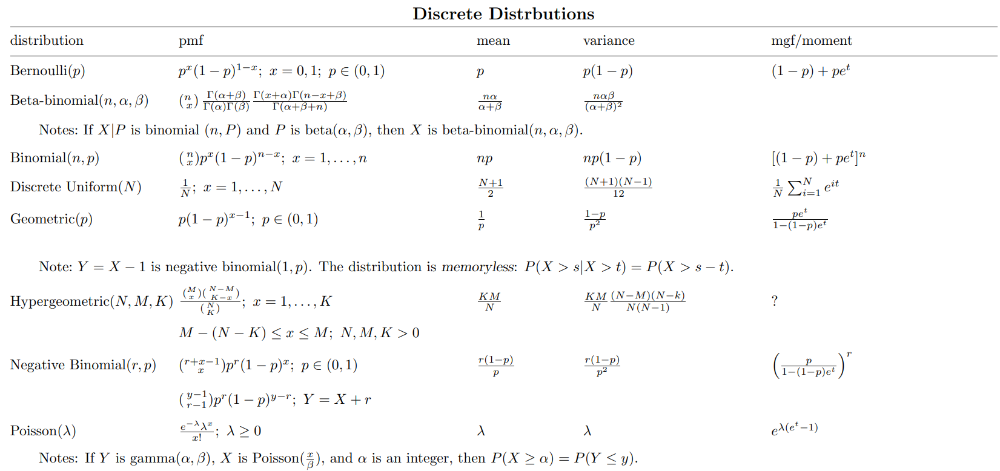
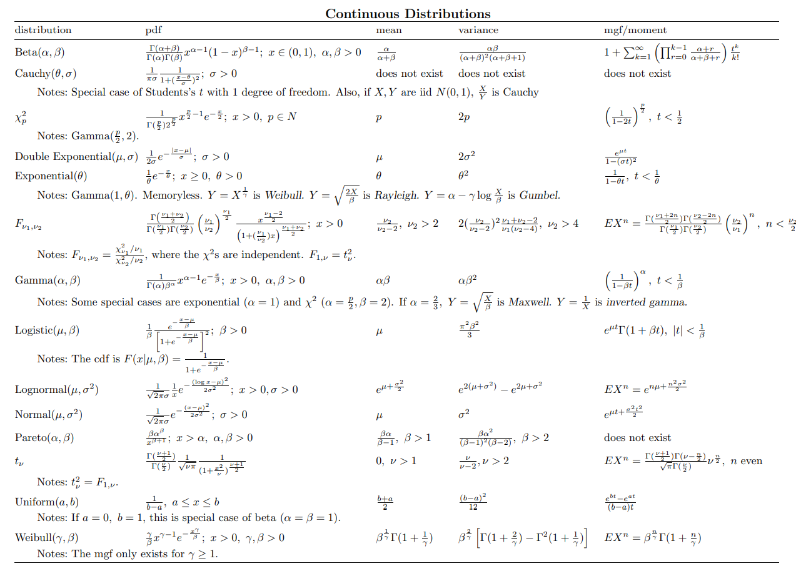
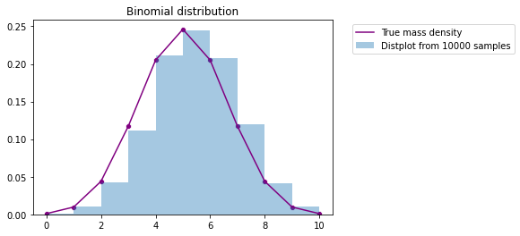
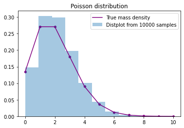
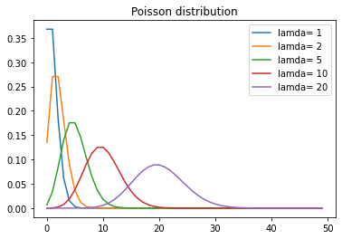
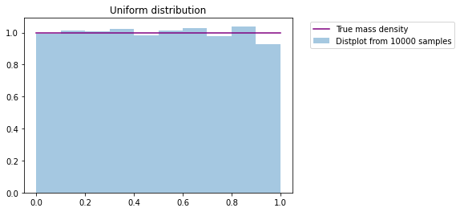
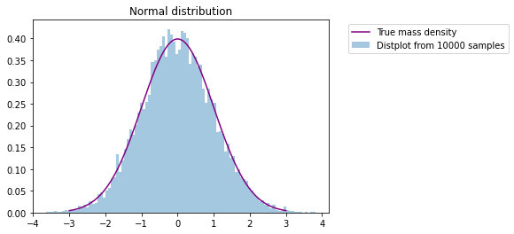
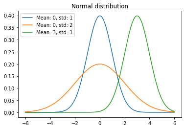
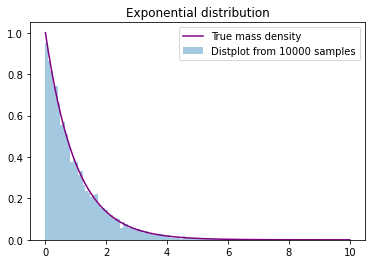
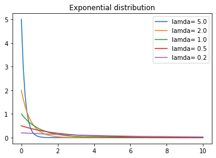

## 1 一般随机变量

### 1.1 随机变量的两种类型

根据随机变量可能取值的个数分为离散型（取值有限）和连续型（取值无限）两类。

### 1.2 离散型随机变量

对于离散型随机变量，使用概率质量函数（probability mass function），简称PMF，来描述其分布律。

假定离散型随机变量X，共有n个取值，$X_1$, $X_2$, ......, $X_n$, 那么
$$ P(X=X_n) \geq 0 $$

$$
\Sigma_{1}^{n} P(X=X_n) =1
$$
```math
P(X=X_n) \geq 0 

\Sigma_{1}^{n} P(X=X_n) =1
```

用到PMF的例子：二项分布，泊松分布

### 1.3 连续型随机变量

对于连续型随机变量，使用概率密度函数（probability density function），简称PDF，来描述其分布情况。

连续型随机变量的特点在于取任何固定值的概率都为0，因此讨论其在特定值上的概率是没有意义的，应当讨论其在某一个区间范围内的概率，这就用到了概率密度函数的概念。

假定连续型随机变量X，f(x)为概率密度函数， 对于任意实数范围如[a,b]，有
$$
P \lbrace a\leq X \leq b\rbrace = \int ^b_a f(x) {\rm d}x
$$
```math
P \lbrace a\leq X \leq b\rbrace = \int ^b_a f(x) {\rm d}x
```

用到PDF的例子：均匀分布，正态分布，指数分布

对于连续型随机变量，通常还会用到累积分布函数 (cumulative distribution function)，简称CDF，来描述其性质，在数学上CDF是PDF的积分形式。

分布函数F(x)在点x处的函数值表示X落在区间(−∞,x]内的概率，所以分布函数就是定义域为R的一个普通函数，因此我们可以把概率问题转化为函数问题，从而可以利用普通的函数知识来研究概率问题，增大了概率的研究范围。


## 2 常见分布

本节通过一些实际例子来认识各种不同的分布及其应用场景

### 2.1 离散型分布

#### 2.1.1 二项分布（Binomial distribution）

二项分布可以认为是一种只有两种结果（成功/失败)的单次试验重复多次后成功次数的分布概率。

二项分布需要满足以下条件：

- 试验次数是固定的
- 每次试验都是独立的
- 对于每次试验成功的概率都是一样的

一些二项分布的例子：

- 销售电话成功的次数
- 一批产品中有缺陷的产品数量
- 掷硬币正面朝上的次数
- 在一袋糖果中取糖果吃，拿到红色包装的次数

在n次试验中，单次试验成功率为p，失败率q=1-p，则出现成功次数的概率为
$$
P(X=x) = C_n^x p^x q^{n-x}
$$

#### 2.1.2 泊松分布（Poisson distribution）

泊松分布是用来描述泊松试验的一种分布，满足以下两个特征的试验可以认为是泊松试验：

- 所考察的事件在任意两个长度相等的区间里发生一次的机会均等
- 所考察的事件在任何一个区间里发生与否和在其他区间里发生与否没有相互影响，即是独立的

泊松分布需要满足一些条件：

- 试验次数n趋向于无穷大
- 单次事件发生的概率p趋向于0
- np是一个有限的数值

泊松分布的一些例子：

- 一定时间段内，某航空公司接到的订票电话数
- 一定时间内，到车站等候公交汽车的人数
- 一匹布上发现的瑕疵点的个数
- 一定页数的书刊上出现的错别字个数

一个服从泊松分布的随机变量X，在具有比率参数（rate parameter）λ （λ=np）的一段固定时间间隔内，事件发生次数为i的概率为
$$
P\lbrace X= i \rbrace = e^{-λ} \frac{λ^i}{i!}
$$
```math
P\lbrace X= i \rbrace = e^{-λ} \frac{λ^i}{i!}
```


#### 2.1.3 二项分布，泊松分布，正态分布的关系

这三个分布之间具有非常微妙的关联。

当n很大，p很小时，如*n* ≥ 100 and *np* ≤ 10时，二项分布可以近似为泊松分布。

当λ很大时，如λ≥1000时，泊松分布可以近似为正态分布。

当n很大时，np和n(1-p)都足够大时，如n ≥ 100 , np  ≥10，n(1-p) ≥10时，二项分布可以近似为正态分布。

#### 2.1.4 其他离散型随机分布

除了二项分布和泊松分布以外，还有其他一些不太常用的离散型分布。

##### 几何分布（Geometric distribution）

考虑独立重复试验，几何分布描述的是经过k次试验才首次获得成功的概率，假定每次成功率为p，
$$
P\lbrace X= n \rbrace = {(1-p)}^{n-1} p
$$
```math
P\lbrace X= n \rbrace = {(1-p)}^{n-1} p
```


##### 负二项分布（Negative binomial distribution）

考虑独立重复试验，负二项分布描述的是试验一直进行到成功r次的概率，假定每次成功率为p，
$$
P\lbrace X= n \rbrace = C_{n-1}^{r-1} p^r {(1-p)}^{n-r}
$$
```math
P\lbrace X= n \rbrace = C_{n-1}^{r-1} p^r {(1-p)}^{n-r}
```


##### 超几何分布（Hypergeometric Distribution）

超几何分布描述的是在一个总数为N的总体中进行有放回地抽样，其中在总体中k个元素属于一组，剩余N-k个元素属于另一组，假定从总体中抽取n次，其中包含x个第一组的概率为
$$
P\lbrace X= n \rbrace = \frac {C_{k}^{x} C_{N-k}^{n-x}} {C_{N}^{n}}
$$
```math
P\lbrace X= n \rbrace = \frac {C_{k}^{x} C_{N-k}^{n-x}} {C_{N}^{n}}
```


### 2.2 连续型分布

#### 2.2.1 均匀分布 （Uniform distribution）

均匀分布指的是一类在定义域内概率密度函数处处相等的统计分布。

若X是服从区间[a,b]上的均匀分布，则记作X~U[a,b]。

均匀分布X的概率密度函数为
$$
f(x)= \begin{cases} \frac {1} {b-a} ,  &  a \leq x  \leq b \\ 0, & others \end{cases}
$$
```math
f(x)= \begin{cases} \frac {1} {b-a} ,  &  a \leq x  \leq b \\ 0, & others \end{cases}
```

分布函数为
$$
F(x)=\begin{cases}
0 ,  &  x< a \\
(x-a)(b-a), & a \leq x  \leq b \\
1, & x>b
\end{cases}
$$
```math
F(x)=\begin{cases}
0 ,  &  x< a \\
(x-a)(b-a), & a \leq x  \leq b \\
1, & x>b
\end{cases}
```

均匀分布的一些例子：

- 一个理想的随机数生成器
- 一个理想的圆盘以一定力度旋转后静止时的角度

#### 2.2.2 正态分布 （Normal distribution）

正态分布，也叫做高斯分布，是最为常见的统计分布之一，是一种对称的分布，概率密度呈现钟摆的形状，其概率密度函数为
$$
f(x)=\frac{1}{\sqrt{2π}\sigma}e^{\frac{-(x-u)^2}{2\sigma^2}}
$$
```math
f(x)=\frac{1}{\sqrt{2π}\sigma}e^{\frac{-(x-u)^2}{2\sigma^2}}
```

记为X ~ N(μ, $σ^2$) , 其中μ为正态分布的均值，σ为正态分布的标准差

有了一般正态分布后，可以通过公式变换将其转变为标准正态分布 Z ~ N(0,1)，
$$
Z=\frac {X-μ} {σ} 
$$
正态分布的一些例子：

- 成人的身高
- 不同方向的气体分子的运动速度
- 测量物体质量时的误差

正态分布在现实生活有着非常多的例子，这一点可以从中心极限定理来解释，中心极限定理说的是一组独立同分布的随机样本的平均值近似为正态分布，无论随机变量的总体符合何种分布。

#### 2.2.3 指数分布 （Exponential distribution）

指数分布通常被广泛用在描述一个特定事件发生所需要的时间，在指数分布随机变量的分布中，有着很少的大数值和非常多的小数值。

指数分布的概率密度函数为
$$
f(x)=
\begin{cases}
λe^{-λx} ,  &   x  \geq 0 \\
0, & x < 0
\end{cases}
$$
```math
f(x)=
\begin{cases}
λe^{-λx} ,  &   x  \geq 0 \\
0, & x < 0
\end{cases}
```
记为 X~E（λ),   其中λ被称为率参数（rate parameter），表示每单位时间发生该事件的次数。

分布函数为
$$
F(a) = P\{X \leq a\} = 1-e^{-λa},  a\geq 0
$$
```math
F(a) = P\{X \leq a\} = 1-e^{-λa},  a\geq 0
```

指数分布的一些例子：

- 顾客到达一家店铺的时间间隔
- 从现在开始到发生地震的时间间隔
- 在产线上收到一个问题产品的时间间隔

关于指数分布还有一个有趣的性质的是指数分布是无记忆性的，假定在等候事件发生的过程中已经过了一些时间，此时距离下一次事件发生的时间间隔的分布情况和最开始是完全一样的，就好像中间等候的那一段时间完全没有发生一样，也不会对结果有任何影响，用数学语言来表述是
$$
P\{X>s+t | X> t\} =P\{X>s\}
$$
```math
P\{X>s+t | X> t\} =P\{X>s\}
```


#### 2.2.4 其他连续分布

**$\Gamma$分布**

常用来描述某个事件总共要发生n次的等待时间的分布

**威布尔分布 （Weibull distribution）**

常用来描述在工程领域中某类具有“最弱链”对象的寿命


### 2.3 常见分布的均值和方差汇总

离散型分布



连续型分布



图片来自于 [Statistical Inference by Casella and Berger]


### 2.4 Python 代码实战

#### 2.4.1 生成一组符合特定分布的随机数

在Numpy库中，提供了一组random类可以生成特定分布的随机数

```python
import numpy

# 生成大小为1000的符合b(10,0.5)二项分布的样本集
s = numpy.random.binomial(n=10,p=0.5,size=1000)

# 生成大小为1000的符合P(1)的泊松分布的样本集
s = numpy.random.poisson(lam=1,size=1000)

# 生成大小为1000的符合U(0,1)均匀分布的样本集，注意在此方法中边界值为左闭右开区间
s = numpy.random.uniform(low=0,high=1,size=1000)

# 生成大小为1000的符合N(0,1)正态分布的样本集，可以用normal函数自定义均值，标准差，也可以直接使用standard_normal函数
s = numpy.random.normal(loc=0,scale=1,size=1000)
s = numpy.random.standard_normal(size=1000)

# 生成大小为1000的符合E(1/2)指数分布的样本集，注意该方法中的参数为指数分布参数λ的倒数
s = numpy.random.exponential(scale=2,size=1000)
```

除了Numpy，Scipy也提供了一组生成特定分布随机数的方法

```python
# 以均匀分布为例，rvs可用来生成一组随机变量的值
from scipy import stats
stats.uniform.rvs(size=10)
```

#### 2.4.2 计算统计分布的PMF和PDF

Scipy库提供了一组用于计算离散型随机变量PMF和连续型随机变量PDF的方法。

```python
from scipy import stats

# 计算二项分布B(10,0.5)的PMF
x=range(11)
p=stats.binom.pmf(x, n=10, p=0.5)

# 计算泊松分布P(1)的PMF
x=range(11)
p=stats.poisson.pmf(x, mu=1)

# 计算均匀分布U(0,1)的PDF
x = numpy.linspace(0,1,100)
p= stats.uniform.pdf(x,loc=0, scale=1)

# 计算正态分布N(0,1)的PDF
x = numpy.linspace(-3,3,1000)
p= stats.norm.pdf(x,loc=0, scale=1)

# 计算指数分布E(1)的PDF
x = numpy.linspace(0,10,1000)
p= stats.expon.pdf(x,loc=0,scale=1)
```

#### 2.4.3 计算统计分布的CDF

类似计算概率质量/密度函数的方法，只需将上节中的pmf或pdf替换为cdf，即可得到分布函数的值

```python
# 以正态分布为例，计算正态分布N(0,1)的CDF
x = numpy.linspace(-3,3,1000)
p = stats.norm.cdf(x,loc=0, scale=1)
```

#### 2.4.4 统计分布可视化

##### **二项分布**

比较n=10，p=0.5的二项分布的真实概率质量和10000次随机抽样的结果

```python
from scipy import stats
import matplotlib.pyplot as plt
import seaborn as sns

x = range(11)  # 二项分布成功的次数（X轴）
t = stats.binom.rvs(10,0.5,size=10000) # B(10,0.5)随机抽样10000次
p = stats.binom.pmf(x, 10, 0.5) # B(10,0.5)真实概率质量

fig, ax = plt.subplots(1, 1)
sns.distplot(t,bins=10,hist_kws={'density':True}, kde=False,label = 'Distplot from 10000 samples')
sns.scatterplot(x,p,color='purple')
sns.lineplot(x,p,color='purple',label='True mass density')
plt.title('Binomial distribution')
plt.legend(bbox_to_anchor=(1.05, 1))
```



##### **泊松分布**

比较λ=2的泊松分布的真实概率质量和10000次随机抽样的结果

```python
from scipy import stats
import matplotlib.pyplot as plt
import seaborn as sns
x=range(11)
t= stats.poisson.rvs(2,size=10000)
p=stats.poisson.pmf(x, 2)

fig, ax = plt.subplots(1, 1)
sns.distplot(t,bins=10,hist_kws={'density':True}, kde=False,label = 'Distplot from 10000 samples')
sns.scatterplot(x,p,color='purple')
sns.lineplot(x,p,color='purple',label='True mass density')
plt.title('Poisson distribution')
plt.legend()
```



比较不同参数λ对应的概率质量函数，可以验证随着参数增大，泊松分布开始逐渐变得对称，分布也越来越均匀，趋近于正态分布

```python
x=range(50)
fig, ax = plt.subplots()
for  lam in [1,2,5,10,20] :
        p=stats.poisson.pmf(x, lam)
        sns.lineplot(x,p,label='lamda= '+ str(lam))
plt.title('Poisson distribution')
plt.legend()
```



##### **均匀分布**

比较U(0,1)的均匀分布的真实概率密度和10000次随机抽样的结果

```python
from scipy import stats
import matplotlib.pyplot as plt
import seaborn as sns
x=numpy.linspace(0,1,100)
t= stats.uniform.rvs(0,1,size=10000)
p=stats.uniform.pdf(x, 0, 1)

fig, ax = plt.subplots(1, 1)
sns.distplot(t,bins=10,hist_kws={'density':True}, kde=False,label = 'Distplot from 10000 samples')

sns.lineplot(x,p,color='purple',label='True mass density')
plt.title('Uniforml distribution')
plt.legend(bbox_to_anchor=(1.05, 1))
```



##### **正态分布**

比较N(0,1)的正态分布的真实概率密度和10000次随机抽样的结果

```python
from scipy import stats
import matplotlib.pyplot as plt
import seaborn as sns
x=numpy.linspace(-3,3,100)
t= stats.norm.rvs(0,1,size=10000)
p=stats.norm.pdf(x, 0, 1)

fig, ax = plt.subplots(1, 1)
sns.distplot(t,bins=100,hist_kws={'density':True}, kde=False,label = 'Distplot from 10000 samples')


sns.lineplot(x,p,color='purple',label='True mass density')
plt.title('Normal distribution')
plt.legend(bbox_to_anchor=(1.05, 1))
```



比较不同均值和标准差组合的正态分布的概率密度函数

```python
x=numpy.linspace(-6,6,100)
p=stats.norm.pdf(x, 0, 1)
fig, ax = plt.subplots()
for  mean, std in [(0,1),(0,2),(3,1)]: 
        p=stats.norm.pdf(x, mean, std)
        sns.lineplot(x,p,label='Mean: '+ str(mean) + ', std: '+ str(std))
plt.title('Normal distribution')
plt.legend()
```



##### **指数分布**

比较E(1)的指数分布的真实概率密度和10000次随机抽样的结果

```python
from scipy import stats
import matplotlib.pyplot as plt
import seaborn as sns
x=numpy.linspace(0,10,100)
t= stats.expon.rvs(0,1,size=10000)
p=stats.expon.pdf(x, 0, 1)

fig, ax = plt.subplots(1, 1)
sns.distplot(t,bins=100,hist_kws={'density':True}, kde=False,label = 'Distplot from 10000 samples')


sns.lineplot(x,p,color='purple',label='True mass density')
plt.title('Exponential distribution')
plt.legend(bbox_to_anchor=(1, 1))
```



比较不同参数的指数分布的概率密度函数

```python
x=numpy.linspace(0,10,100)
fig, ax = plt.subplots()
for  scale in [0.2,0.5,1,2,5] :
        p=stats.expon.pdf(x, scale=scale)
        sns.lineplot(x,p,label='lamda= '+ str(1/scale))
plt.title('Exponential distribution')
plt.legend()
```

